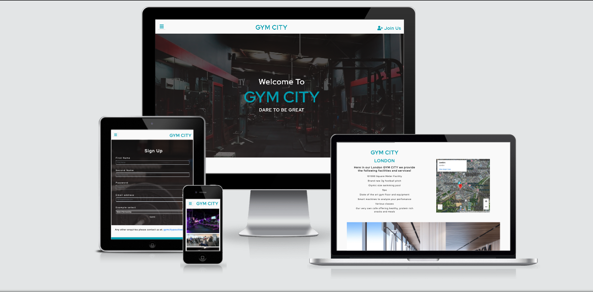
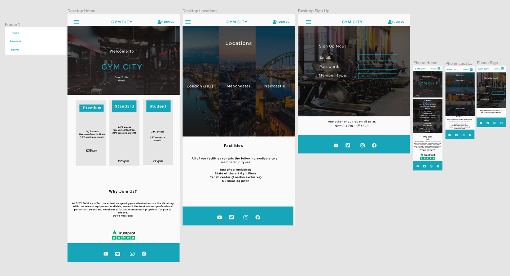

# GYM CITY : A Gym Website

[Live Demo](https://ryanjbm.github.io/Milestone-Project-1/)

# Introduction

Gym City is a web page built to get users to sign up to the gym as well as informing them of the locations, facilities, prices and members of staff. Personally, I have always been passionate about fitness so the opportunity to build a website for a gym excited me, I made the website user friendly and including the content that I'd like to see if I were going to join a new gym.

This is my first Milestone Project for my Full Stack Development Program at Code Institute, in which i was given instructions to make a static and responsive website including at least 3 pages. In creating this website I used CSS3 and HTML5.

# UX

## Goals
  

  
* To make GYM CITY look premium and reliable to the customer
* To create an aesthetically pleasing and easy to navigate webpage for the customer
* Easy for the customer to sign up
* To make a responsive and eye catching website across all devices

 
## User Stories

1. I am a user who would like to sign up to GYM CITY to begin my fitness journey
1. I am a user who is currently a member of another gym looking at what GYM CITY has to offer instead
1. I am a manager of a different gym looking at what the competition has to offer
1. I am a user who primarily uses a mobile phone and would like the website to function and look good on my mobile
1. I am a user who is trying to find out the locations of GYM CITY in the UK

## Design Process

1. I started my process by planning out what I wanted to include in my website and what the pages should be. I settled on including a "Home Page", "Locations Page", "Gallery Page" and a. "Sign Up Page". 
1. I wanted to keep my website aesthetically pleasing, so I decided on a simple but nice to look at colour scheme and one font to use throughout the entire web page. The colours and font I used were:  
   #fafafa  
   #16A5B9  
   Red Hat Display  
 I found this combination nice to look at yet still maintained the modern, streamlined appearance I was aiming for.
1. I wireframed my project using FIGMA. I used the colour wheel to find the exact shade I wanted and used this throughout the project. I created my pages for desktop layout first setting out the basics of the page and once that was completed I made the mobile version of the website. I made changes throughout the design process following input from family, friends and my mentor
1. I then took this wireframe and proceeded to put it together on gitpod, changing some minor aspects of the website and adding new features that I discovered along the way. The main change I made was adding the "Gallery Page" which initially wasn't on my wireframe.

## Figma Wireframe
> This includes the wireframes for both desktop and mobile device layouts

Throughout the process of coding my website and input from other people, a few improvements were made to the website to not only make it look more profesional but also to include more useful features.

# Features

## Feaures throughout pages
* A Navigation bar header which includes a GYM CITY logo which takes you back to the home page, a join us button which takes you to the Sign up page and a burger drop down menu button which shows the links to all 4 pages. When hovering over any part of the navbar the text becomes orange
* A back to the top button available at the bottom of every page, when clicked automatically scrolls back to the top
* Footer remains the same across all pages with social media links turning orange when hovering over them

## Home
* Main Image zooms in when the page loads each time
* Spinning boxes revealing membership prices and features when hover over
* Review box showing percentages of how many people vote for each star
* Cards showing the managers and content about the gym

## Locations
* Three images of each city, when click on the text of one it scrolls down to the part of the page where it talks about that gym
* Embedded maps showing the locations
* Information and pictures of each facility
* Join us button, redirecting to the sign up page when clicked

## Gallery
* Images on a responsive grid of all the gyms

## Sign Up
* Form for user to fill in so they can sign up, all fields are required and includes a dropdown menu for the type of membership
* Link to the email for other enquiries which opens in a new tab
* Three cards showing the membership prices and what they include

# Technologies Used

## Languages
* HTML5
  * Base language for the project used to add content to the website
* CSS3
  * Used to style the HTML code
* Bootstrap Framework
  * Used Bootstraps grid system and styles for buttons to help the web page be more responsive for mobile layouts
* FontAwesome
  * Used 3 different FontAwesome icons for my website
* Google Fonts
  * Used the Red Hat Display font from here
* Google Images
  * Used for all of my images, each was checked to be copyright free
* W3C Schools
  * Used for help with the code in my project, I found it very useful for my form and gallery page
* W3C Markup Validation
  * Used this to check that my HTML and CSS code were both valid throughout my project
* Stack Overflow
  * I used this to help me with small issues I encountered when writing my code
* CodePen
  * I used this to learn how to implement spinning cards and the review box in my project

# Testing
## Testing User Stories

1. The user wanted to join the gym, to reach the sign up page only required one click on the join us button in the navigation bar, they then filled in the form and clicked the submit button, filling in each field as required
1. The user wished to see what GYM CITY had to offer versus their current gym, to find this information out they scrolled down on the main page to read what the gym has to offer along with the membership prices and features for each one. They then in two clicks go to the dropdown menu and select locations, once page loaded they can scroll through and read about what each facility offers and where it is. They can also view the gallery page from the dropdown menu to view more images of the facilities.
1. The user wanting to see what the competition has to offer can do the same as the user wanting to see what the gym is like viewing the home, gallery and location pages in only a few clicks
1. All pages are responsive on mobile devices so the user on their phone will have no problem navigating the site
1. The user wanting to see locations only has to open the dropdown menu and click the locations page to be able to see the embedded maps

## Testing Devices

My webpage was tested using Google Developer Tools to see if its responsive. All devices were tested succesfully includng Iphones, Samsungs and Ipads of different screen sizes

## Validating HTML5 and CSS3 code

My code was tested on the WC3 Validation pages and passed all tests

## Different Browsers

I tested my page on the following browsers and found it worked on all

* Safari
* Chrome
* Firefox
